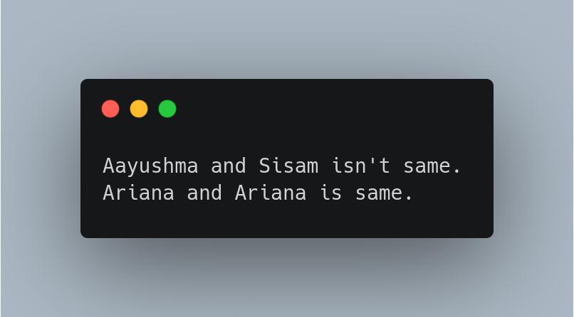

# Day 01

<p>September 5, 2022</p>

### Question:

<p>Create a class Person that contains person ID, name, and age as an attributes and do the following tasks,
    
    - Create two objects

    - Compare whether the data is same or not
</p>

### Source Code:

```csharp
public class MyClass
{
    public static void Main(string[] args){
        Person p1 = new Person(1, "Aayushma", 21);
        Person p2 = new Person(2, "Sisam", 21);
        Person p3 = new Person(3, "Ariana", 25);
        Person p4 = new Person(4, "Ariana", 25);

        if(p1.name == p2.name){
            Console.WriteLine(p1.name + " and " + p2.name + " is same.");
        }else{
            Console.WriteLine(p1.name + " and " + p2.name + " isn't same.");
        }

        if (p3.name == p4.name){
            Console.WriteLine(p3.name + " and " + p4.name + " is same.");
        }else{
            Console.WriteLine(p3.name + " and " + p4.name + " isn't same.");
        }
    }
}

class Person
{
    public int pID;
    public string name;
    public int age;

    public Person(int pID, string name, int age){
        this.pID = pID;
        this.name = name;
        this.age = age;
    }
}
```

### Output:

