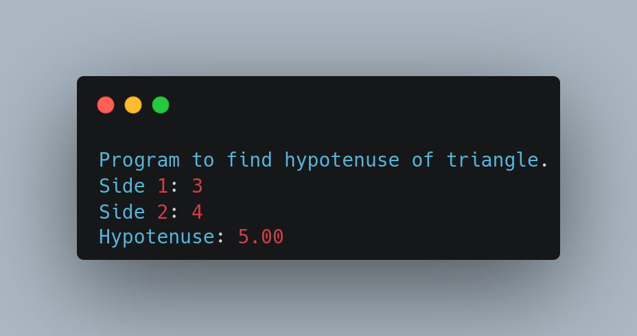

# Lab 01

Name: WAP to find the hypotenuse of triangle.

Date: Sept 05, 2022

## Source Code

```csharp
using System;

public class Hypotenus{
    
    static double findHypotenuse(double side1, double side2){
        double h = Math.Sqrt((side1 * side1) + (side2 * side2));
        return h;
    }

    public static void Main(string[] args){
        double side1, side2;

        Console.WriteLine("Program to find hypotenuse of triangle.");

        Console.Write("Side 1: ");
        side1 = Convert.ToDouble(Console.ReadLine());

        Console.Write("Side 2: ");
        side2 = Convert.ToDouble(Console.ReadLine());

        Console.WriteLine("Hypotenuse: {0:F2}", findHypotenuse(side1, side2));
    }
}
```

## Output

